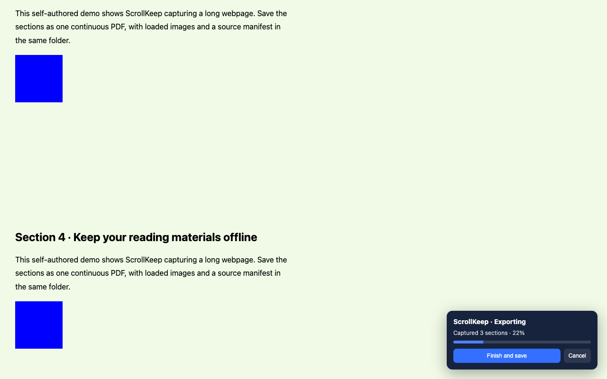

# ScrollKeep · 长页存档

自动滚动目标网页，保存为一张连续长页 PDF，同时下载沿途遇到的网页图片。可切换标签页、窗口或使用其他应用，任务在后台继续。

Archive long webpages as a continuous single-page PDF, with their images in the same download folder. ScrollKeep runs locally and continues while you use other tabs or applications.

[下载发布包](https://github.com/SweetWiseFeather/scrollkeep/releases) · [隐私政策](PRIVACY.md) · [商店发布说明](STORE.md) · [MIT 许可证](LICENSE)



## 浏览器兼容性

| 浏览器桌面版 | 状态 |
| --- | --- |
| Chrome 118+ | 已验证后台截图和导出流程 |
| Microsoft Edge、Brave、Vivaldi、Opera | 支持 Chrome 扩展，预期兼容；本项目尚未逐一实测 |
| Firefox | 当前不支持，需要替换 debugger 后台截图实现 |
| Safari | 当前不支持，需要适配截图接口并单独打包 |

本次发布目标是 Chrome 扩展商店。Chrome 商店里的扩展可以被其他支持该商店的桌面浏览器安装；这不等于自动发布到了 Edge 或 Opera 自己的商店。手机浏览器不在本版本的支持范围内。

## 安装与更新

1. 从 [GitHub Releases](https://github.com/SweetWiseFeather/scrollkeep/releases) 下载 ZIP 并解压，或克隆仓库。ZIP 是开发者模式安装/商店上传包，不能直接拖入浏览器安装。
2. Chrome 地址栏打开 `chrome://extensions/`。
3. 打开“开发者模式”，点击“加载已解压的扩展程序”，选择包含 manifest.json 的解压文件夹。
4. 已安装的插件点击“重新加载”，然后刷新目标网页。
5. 需要 Chrome 118 或更新版本。新版新增 `debugger` 权限，用来对指定标签页截图；导出期间 Chrome 会显示调试提示，完成或取消后自动解除连接。目标页已有开发者工具或其他调试连接时，请先关闭。

商店版本正式上线后，可以直接从商店安装和自动更新。GitHub 发布包不代表已通过商店审核。

## 使用

1. 打开目标网页，确认已经登录且能正常查看内容，展开需要保存的折叠块。
2. 点击插件图标，选择截图间隔和是否从顶部开始，点击“开始自动导出”。
3. 可以切换到其他标签页或应用。保持目标页打开，避免刷新、跳转、手动滚动、改变窗口大小或缩放。电脑休眠、退出浏览器会中断任务。
4. 在任意标签页点击插件图标，可以查看进度、取消或“到此结束并生成”。目标网页右下角也有控制条。
5. 文件自动保存在 Chrome 下载目录中的独立文件夹，例如：

```
网页笔记_20260930_153010_a1b2c3d4/
  网页笔记_20260930.pdf
  images/
    0001.png
    0002.webp
  export-info.json
```

PDF、图片和清单在同一导出文件夹中。文件夹带时间和随机标识，重复导出不会覆盖旧结果。没有图片时，不会创建空的 images 文件夹。每张图片按实际格式命名；无法确认格式时使用 .img。清单记录网页地址、是否提前结束、图片来源、保存路径和失败原因；再次打开插件可查看最后结果。Chrome 若启用了“下载前询问每个文件的保存位置”，请关闭该设置以便自动保存到同一文件夹。

完成或取消后恢复原来的滚动位置和页面样式。取消时已经下载的文件会保留。

## 0.3.0 修复

- 使用 `chrome.debugger` 和 `Page.captureScreenshot` 对目标标签页截图，取消原来的前台等待。Chrome 118 起调试会话也能保持扩展后台任务运行。
- 保留连续单页 PDF、按绝对像素位置裁切与片段重叠，避免分页和拼接缺行。超长 PDF 使用 UserUnit 保持页面比例。
- 兼容普通网页和内部滚动正文；修复兼容模式网页错误地把完整文档高度当作视口高度的问题。
- 等待可见图片及布局稳定，收集 img 当前清晰度、SVG image 引用和可见 CSS 背景图片；边滚动边保存，避免虚拟化正文移除图片后丢失来源。同一 URL 只保存一次。
- 优先读取浏览器已加载的图片资源；其次在原网页读取 blob、data 和允许读取的图片，最后尝试带浏览器登录信息的普通下载。单张图片失败会记录到清单，继续生成 PDF。
- 在任意标签页控制任务并查看最后结果；增加下载完成检查、两分钟下载超时、断开调试连接提示以及资源释放。

## 限制

- PDF 保存的是网页截图，文字不能选择或搜索。特别长的单页在部分 PDF 阅读器中可能显示不全，可以换用支持 PDF 1.7 UserUnit 的阅读器。
- 只保存当前账号能看到、且自动滚动过程中加载出的内容。未展开的内容、需要点击才能加载的图片、跨域 iframe、封闭 Shadow DOM、canvas 原图、视频和白板无法保证单独下载。
- 原图指网页实际加载的图片版本；不会自动查找网页没有加载的更高分辨率文件。相同图片使用不同 URL 时可能重复保存。
- 固定在正文内部的工具条可能重复出现在 PDF 中。网页持续加载、正文跳动或窗口尺寸改变时，可能需要调整间隔并重新导出。
- 超长文档会占用内存。受权限、登录状态或防盗链限制的图片可能下载失败，详见 export-info.json。
- 提前结束仅保存已经捕获的正文；图片清单可能包含当时已挂载在页面中但尚未滚动到的图片。
- 自动保存路径相对于 Chrome 下载目录，浏览器不允许扩展静默写入任意磁盘路径。

## 验证

使用 Node.js 22+。项目没有第三方运行时或构建依赖，不需要 npm install。

```sh
npm test
npm run build
```

构建产物为 `dist/scrollkeep-0.3.3.zip`，manifest.json 位于 ZIP 根目录。当前发布版免费，不启用试用限制或收款；默认英文，中文浏览器显示中文。构建只包含明确列出的运行文件、语言资源、图标和许可说明，排除备份、测试、缓存和个人文件。图标由 `scripts/build-icons.mjs` 生成。

`node --test tests/export.test.mjs`：验证后台导出流程、图片去重、失败清单、取消、调试断开、下载超时、拼接坐标以及超长单页 PDF 结构。

`npm run test:browser`：在独立临时 Chrome 配置中验证切换标签页后的真实截图、完整滚动、懒加载图片、缓存和 blob 图片读取、页面恢复，以及真实 JPEG 编码和单页 PDF 合并。此测试当前适用于默认安装路径的 macOS Chrome，不会访问当前浏览器账号或网页。测试临时配置位于系统临时目录。

## 开源与反馈

本项目以 MIT 许可证发布，可以使用、修改及再分发，保留许可证和版权声明即可。欢迎通过 [GitHub Issues](https://github.com/SweetWiseFeather/scrollkeep/issues) 报告问题；请优先提供公开测试网页，避免上传私人文档、访问令牌或带登录签名的地址。

## 隐私

截图和 PDF 在本机处理。下载图片只会访问网页原本引用的图片地址；没有上传截图、图片或清单的服务器。export-info.json 包含原网页及图片来源地址，分享文件夹前请留意其中可能带有的登录签名参数。
